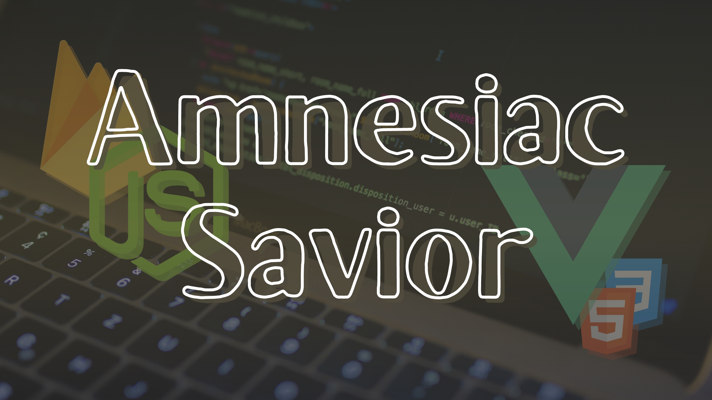

# Amnesiac Savior: Plan Important Events with a Click.

[](https://github.com/Moenupa/AmnesiacSavior)

For further information, visit [documentation](https://www.notion.so/moenupa/COMP3421-Final-Project-Amnesiac-Savior-146b37802de44fa4a7595ff21c766afc#9a371c4f163d43f3ad9b9b99daffb10f).

## Deployment

You can access this web application directly via [this link🔗](https://amnesiac-savior.herokuapp.com/).

Alternatively, if you would like to deploy this project locally, execute the following script. (You can also use unzip source code package to replace `git clone` command)

```sh
git clone https://github.com/Moenupa/AmnesiacSaviorWeb.git
cd AmnesiacSaviorWeb
npm install
npm run build
npm run start
```

## Motivation

Blackboard learn is considered a great web study platform, but sometimes its information is so detailed that students may miss important events. In addition, blackboard monitors flooded messages of all courses, important notification is not sufficiently emphasized for forgetful guys like one of the developers.

Thus, to prevent forgetful guys from missing their quizzes, DDLs, and other important events, we decided to develop Amnesiac Savior in aid of recording important events.

## Outline

A **web application** with which users can schedule their desired events with custom alert messages. 

> 🗃 Cloud Synchronization, and ListView Management

The web application supports list-view of all events, event scheduling, and cloud synchronization.

## Highlights

- View and Manage all deadlines in a ListView
- Cloud database to synchronize between devices
- Material Design

## Implementation

- Backend: Firebase and Heroku with node.js hosting
- Frontend: Vue.js, JavaScript, HTML, CSS

## Usage

1. Enter a token to distinguish from others. The token can be re-used and if so, data will be restored.
2. Select a date.
3. Add, mark as finished or permanently delete todo-item(s).
4. Select any date to examine or modify todo-items.

## Notice

- Full browser support is not yet completed. For the time being, access via Chrome or Chromium to obtain the best experience.
- Token should not be too simple to prevent other's access

## License

This project is licensed under the [GPL-3.0](./LICENSE).

## Reference

- [Nuxt & Firebase](https://firebase.nuxtjs.org/)
- [Simple ToDo List with Vue.js](https://vuejsfeed.com/blog/simple-todo-list-with-vue-js)
- [vue2-datepicker](https://github.com/mengxiong10/vue2-datepicker) avaiable via `npm`
- Angel icon from [Angel Icon](https://iconscout.com/icon/angel-369) by [Fauzi Arts](https://iconscout.com/contributors/achmmadfauzi)
